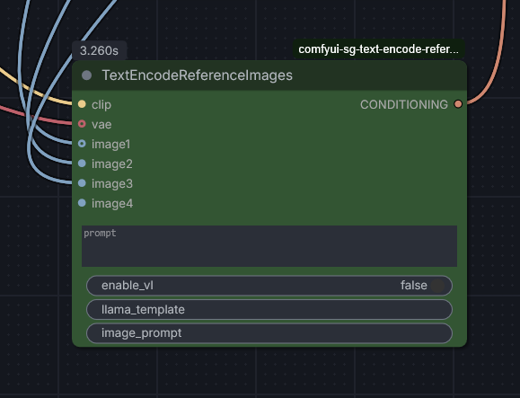

# ComfyUI Text Encode Reference Images

An advanced text encoding node for ComfyUI that supports a dynamic number of reference images.

Mainly for usage with Qwen Image / Flux 2 / Z-Image models.

## Nodes

### Text Encode Reference Images (v2.0.0)
This node allows you to provide a prompt along with multiple reference images that are dynamically handled. It supports multiple Vision-Language (VL) encoding strategies, CLIP Vision encoding, and reference latents.

- **Category**: `conditioning`
- **Features**:
  - **Stable Dynamic Image Slots**: Automatically adds a new `image` input slot when the last one is connected. Intermediate slots remain stable even if disconnected, preventing naming collisions.
  - **Selectable VL Strategies**: 
    - `none`: Standard text encoding without vision-language tokens.
    - `qwen image edit`: Uses hardcoded system templates for Qwen-style image editing.
    - `z-image base omni`: Rebase logic from `TextEncodeZImageOmni` for advanced vision token handling.
  - **CLIP Vision**: Encodes images using an optional `image_encoder` (CLIP Vision) for all strategies.
  - **Auto-Resize**: Scalable image processing that resizes images to ~1MP (~1024x1024) before VAE encoding to maintain efficiency.
  - **Reference Latents**: Optionally encodes input images using a VAE and appends them as `reference_latents` to the conditioning data.
- **Inputs**:
  - `clip`: The CLIP model to use for encoding.
  - `prompt`: The text instruction/prompt.
  - `vl_selection`: Choice of VL strategy (`none`, `qwen image edit`, `z-image base omni`).
  - `auto_resize_images`: (BOOLEAN) If enabled, resizes images to ~1MP for VAE encoding.
  - `vae` (Optional): VAE for encoding reference latents.
  - `image_encoder` (Optional): CLIP Vision model for image encoding.
  - `image1`, `image2`, ...: Dynamic image inputs.
- **Output**:
  - `CONDITIONING`: The encoded conditioning data.

## Installation

1. Place this folder in your ComfyUI `custom_nodes` directory.
2. Restart ComfyUI.
3. The node will appear in the `conditioning` category.
